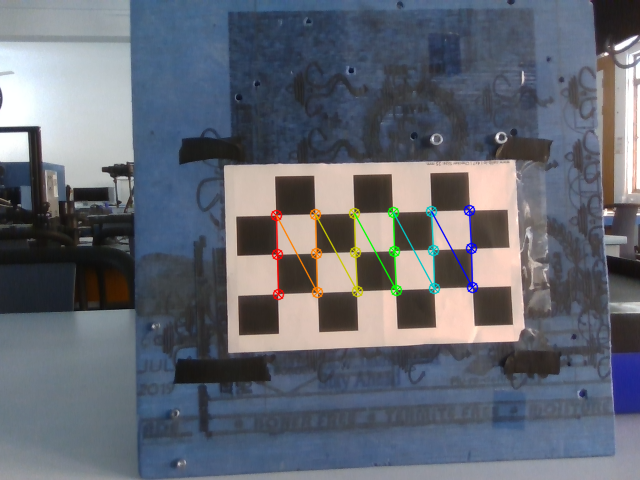

This repository is an OpenCV implementation of camera calibration.

### Procedure for Camera Calibration

1. Run the following:

```bash
python3 camera_calibration.py --devID <cam device id> --imgPath <images path> --calibrateOnly <True or False> --config_file calibConfig.yaml
```

**NOTE:** Modify [calibConfig.yaml](./calibConfig.yaml) for your specific checkboard and camera configuration.

**Example Img**:<br>



### Hand-Eye Calibration (for Fanuc Robotic Arm):

Checkout [perform_calibration_2.py](./perform_calibration_2.py) and [perform_calibration.py](./perform_calibration.py) for hand-eye calibration abstracted usage.<br>
[calibration.py](./calibration.py) has the implementations to collect, and perform hand-eye calibration + camera camera calibration for variours targets like checkerboard and aruco board.

### Old Implementation
  >  ` image_capture.py ` is used to capture images from live feed. <br>
  >  ` image_data\ ` folder have sample chessboard images with patternsize = (3,6). <br>
  >  ` opencv_camera_calibration.py ` has the main opencv camera calibration script. <br>


References:: [https://docs.opencv.org/4.x/dc/dbb/tutorial_py_calibration.html](https://docs.opencv.org/4.x/dc/dbb/tutorial_py_calibration.html)
